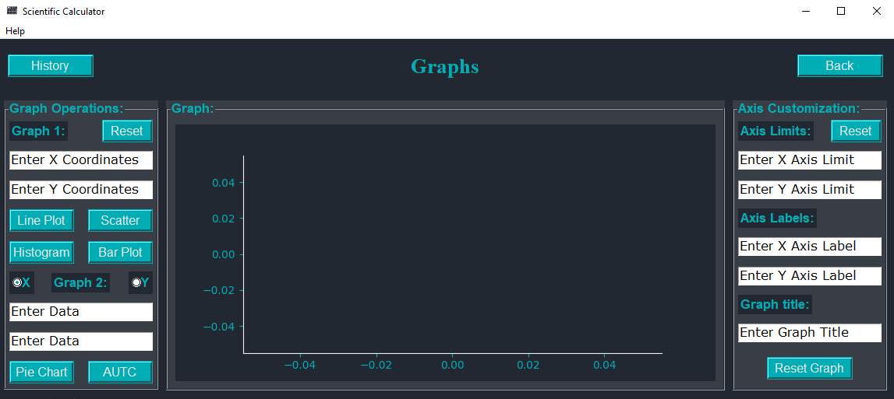

# Engineer's Toolkit
An Engineer's Toolkit that utilizes several technologies and modules from python such as [Numpy](https://numpy.org/), [PIL](https://pillow.readthedocs.io/en/stable/) and [Matplotlib](https://matplotlib.org/).  
GUI is made in [Tkinter](https://docs.python.org/3/library/tkinter.html).

## Motivation

As a new python developer who started coding in the lockdown, I fell in love with python's flexibility, readability and intuitive feel. As I learnt more and more about python's vast repertoire of features and libraries, I wanted to make a project that puts all my newly-acquired skills to the test. Around this time I also discovered tkinter, which, though slightly dated, felt really simple to use and deceptively versatile. Also, tkinter feels like the perfect fit for a calculator type project. I knew I was going to make it open-source, so that people may improve, learn and benefit from this little endeavour of mine.
 Thus motivated and equipped with skills and knowledge of python, I set out to make this calculator.

## Features:

-Arithmetic operations with a myriad of constants and operators  
-Modulus, Absolute value and Percentage calculators  
-Operations on matrices  
-Trigonometric and Logarithmic calculators  
-Plotting bar graphs, histograms, line and scatter plots, pie charts and area bounded by 2 curves  
-Unit Converter(US Imperial, UK Imperial and Metric)    
-Real-Time Currency Converter (Powered by [Alpha Vantage API](https://www.alphavantage.co/))     
-Global precision setting  
-Usage history  
-Help menus to make sense of it all

## How it all happens:

-Python classes are used to load the different frames of the calculator at the press of a button, as well as act as a container    
-[Tkinter](https://docs.python.org/3/library/tkinter.html) frames make up the different pages of the calculator  
-Labels, label frames, buttons, radio buttons, entry fields and text boxes bring the whole thing to life  
-[Numpy](https://numpy.org/) enables matrix operations with it's C-style arrays    
-[Math](https://docs.python.org/3/library/math.html) provides mathematical operations and some constants  
-[PIL](https://pillow.readthedocs.io/en/stable/) enables icons and embedded pictures  
-[Matplotlib](https://matplotlib.org/) and canvas allows for seamless plotting of customizable graphs  
-Global array allows for usage history to be stored till it is cleared or the program is terminated  
-Numerous python features like functions, list comprehension, nested lists and seamless module importing are the backbone of the whole project

## Upcoming features:  
         
-Cheat-sheet of useful math formulae, identities, etc.  
-Complex number operations  

## Planned features:
  
-Release as a .exe file  

## References:

-Colour palette by [Color Hunt](https://colorhunt.co/palette/2763)  
-Numerous articles and answers on [GeeksForGeeks](https://www.geeksforgeeks.org/) and [StackOverflow](https://stackoverflow.com/)  
-Tkinter resources by [sentdex](https://www.youtube.com/playlist?list=PLQVvvaa0QuDclKx-QpC9wntnURXVJqLyk), [freeCodeCamp](https://youtu.be/YXPyB4XeYLA), [Essential Engineering](https://www.youtube.com/watch?v=XO9pqYTTIOA) and [Codemy.com](https://youtu.be/BSfbjrqIw20) on [YouTube](https://www.youtube.com/)
